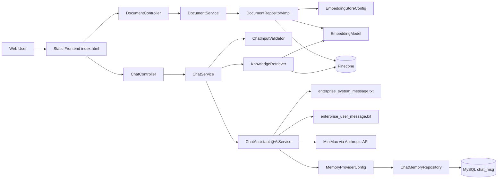

# Enterprise Knowledge Assistant

## 项目背景
企业内部知识通常分散在制度文档、SOP、FAQ、技术规范中，员工在检索和问答时容易遇到信息分散、版本不一致、答复口径不统一的问题。

本项目的目标是构建一个企业知识问答系统：
- 支持知识文档上传、切分、向量化入库
- 支持基于检索增强的对话回答
- 支持按用户维度的多轮会话记忆

## 核心能力
1. 文档上传入库
- 接口：`POST /api/documents/upload`
- 支持上传文本并指定文档类型：`POLICY` / `TECH_TYPE` / `SOP` / `FAQ`
- 文档类型写入 metadata：`document_type`（`policy/tech_type/sop/faq`）

2. 检索增强问答（RAG）
- 接口：`POST /api/chat/dialogue`
- 对用户问题做 embedding 检索，召回相关知识片段后交给大模型生成回答

3. 多轮会话记忆
- 以 `userId` 作为会话标识
- 会话消息持久化到 MySQL `chat_msg` 表

4. 前端联调页面
- 路径：`src/main/resources/static/index.html`
- 提供文档上传面板和模型对话面板

## 架构图


## 数据流
1. 文档上传数据流
- 前端上传 `file + docType`
- `DocumentController -> DocumentService`
- `DocumentService` 读取文本并附加 metadata（`document_type`）
- `DocumentRepositoryImpl` 进行切分（`recursive(100,30)`）+ embedding + 写入 Pinecone

2. 对话数据流
- 前端提交 `userId + message`
- `ChatService` 调用 `ChatInputValidator` 做入参校验
- `KnowledgeRetriever` 对问题向量化并在 Pinecone 检索（当前参数：`maxResults=3`、`minScore=0.6`）
- `ChatService` 将 `context + question` 变量传给 `ChatAssistant`
- `ChatAssistant` 通过 `@SystemMessage(fromResource=...)` + `@UserMessage(fromResource=...)` 调用模型
- 同时结合 MySQL 会话记忆返回结果

## 运行方式
### 1) 环境要求
- JDK 17+
- Maven 3.9+
- MySQL 8+

### 2) 环境变量
- `MINIMAX_API_KEY`
- `PINECONE_API_KEY`

### 3) 配置文件
`src/main/resources/application.properties`
```properties
service.port=8080
langchain4j.anthropic.chat-model.api-key=${MINIMAX_API_KEY}
langchain4j.anthropic.chat-model.base-url=https://api.minimaxi.com/anthropic/v1
langchain4j.anthropic.chat-model.model-name=MiniMax-M2.7
pine.cone.api.key=${PINECONE_API_KEY}
```
说明：如端口不生效，建议改为 `server.port`。

`src/main/resources/db.setting`
```properties
url=jdbc:mysql://localhost:3306/langchain4j
user=root
pass=root
```

### 4) 初始化 MySQL 表
```sql
CREATE DATABASE IF NOT EXISTS langchain4j DEFAULT CHARACTER SET utf8mb4;
USE langchain4j;
CREATE TABLE IF NOT EXISTS chat_msg (
  uid VARCHAR(128) PRIMARY KEY,
  message LONGTEXT NOT NULL
);
```

### 5) 启动
```bash
mvn spring-boot:run
```
访问：`http://localhost:8080/`

## 已知限制
1. 检索召回配置较保守
- 当前 `maxResults=3`，复杂问题仍可能召回不足。

2. 文档处理能力有限
- 当前按纯文本读取，未完整覆盖 PDF/Word 等格式解析。

3. 异常处理与返回码仍可加强
- 缺少统一异常处理与标准化错误响应结构。

4. 配置与密钥管理可进一步规范
- 目前主要依赖环境变量和本地配置文件。

5. 编码与注释历史包袱
- 部分文件存在历史编码痕迹，影响可读性和维护效率。

## 下一阶段规划
1. 提升检索效果
- 支持多片段召回、重排（rerank）、可配置阈值与 topK。

2. 增强文档解析
- 增加 PDF/Word/Markdown 解析链路与清洗流程。

3. 建立统一 API 错误模型
- 引入全局异常处理、错误码规范、请求参数校验。

4. 引入可观测性
- 增加调用链日志、检索命中率、问答质量评估指标。

5. 工程化升级
- 完善单元测试/集成测试
- 增加 CI 流水线与基础质量门禁