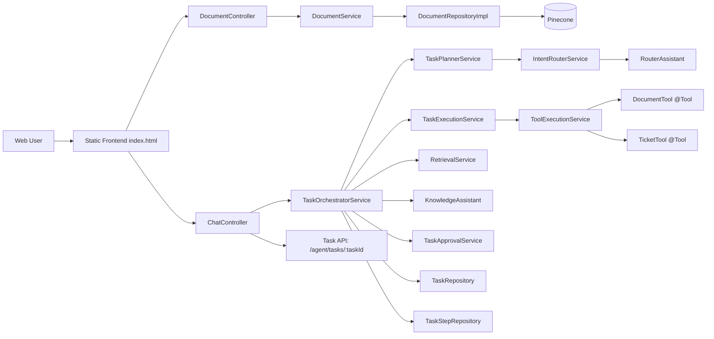
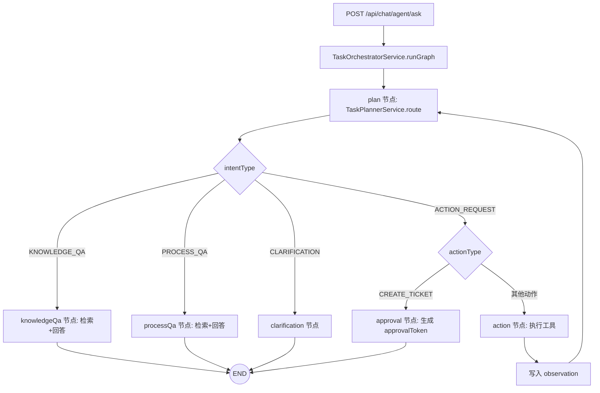
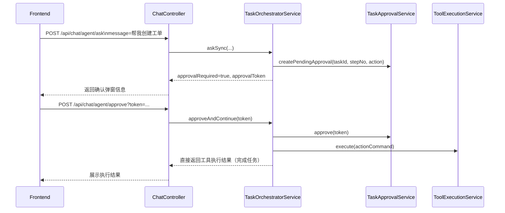

# Enterprise Knowledge Assistant

## 项目背景
企业内部知识通常分散在制度文档、SOP、FAQ、技术规范中。实际使用中常见问题包括：
- 信息分散，检索路径长
- 文档版本不一致，答复口径不统一
- 复杂请求既包含问答也包含动作执行（如查文档、提工单）

本项目目标是构建一个可落地的企业知识助手：
- 支持文档上传、知识入库与检索增强问答（RAG）
- 支持基于 Agent 的意图路由与工具执行
- 支持敏感动作审批确认（approve）

## 核心能力
1. 文档上传入库
- 接口：`POST /api/documents/upload`
- 支持文档类型：`POLICY` / `TECH_TYPE` / `SOP` / `FAQ`

2. Agent 问答（主入口）
- 接口：`POST /api/chat/agent/ask`
- 前端已统一为 Agent 问答入口（不再使用普通对话按钮）

3. 审批执行
- 接口：`POST /api/chat/agent/approve?token=...`
- 接口：`POST /api/chat/agent/clarify`（用户补充澄清信息后继续执行）
- ACTION_REQUEST 需要审批时，前端弹窗确认后调用

4. 动作命令与混合模式工具执行
- `ActionType`?`CREATE_TICKET`
- 保留 `ActionCommand` 强约束路由，执行层使用 LangChain4j `@Tool` 注册方式统一分发

5. 任务型 Agent 编排（LangGraph4j）
- 使用 `TaskOrchestratorService` + `StateGraph` 构建节点流
- 核心节点：`plan` / `action` / `approval` / `knowledgeQa` / `processQa` / `clarification`
- 形成“计划 -> 执行 -> 观察 -> 再计划”闭环

## 架构图


### 流程图（计划-执行-观察-再计划）


### 审批交互示意图


## 数据流
1. 文档上传数据流
- 前端上传 `file + docType`
- `DocumentController -> DocumentService`
- `DocumentService` 处理文本并写入文档元数据
- `DocumentRepositoryImpl` 切分 + embedding + 写入向量库

2. Agent 问答数据流（任务编排）
- 前端提交 `userId + message` 到 `/api/chat/agent/ask`
- `TaskOrchestratorService` 启动 LangGraph4j 图执行（`plan/action/approval/knowledgeQa/processQa/clarification`）
- `plan` 节点由 `IntentRouterService + RouterAssistant` 产出 `IntentDecision(ActionCommand)`
- `ACTION_REQUEST` 非审批动作进入 `action` 节点，执行后带 observation 回到 `plan`，形成多步闭环
- `KNOWLEDGE_QA/PROCESS_QA` 走不同检索参数后由 `KnowledgeAssistant` 生成答案

3. 审批数据流
- `CREATE_TICKET` 在 `approval` 节点返回 `approvalRequired=true` 与 `approvalToken`
- 前端确认后调用 `/api/chat/agent/approve?token=...`
- `approveAndContinue` 直接执行工具并返回结果，不再二次路由

4. 澄清数据流
- 当路由为 `CLARIFICATION` 时，任务状态转为 `WAITING_CLARIFICATION`
- Agent 返回 `clarificationRequired=true` 与 `taskId`
- 用户在输入框补充信息后调用 `/api/chat/agent/clarify`，同一 task 继续执行

5. 可观测性数据流

- 检索层输出 score 与命中文档日志
- 路由层输出原始/解析结果日志
- 工具层输出调用起止日志
- 任务层输出步骤落库（`TaskStep`）与状态流转日志

## 运行方式
### 1) 环境要求
- JDK 17+
- Maven 3.9+
- MySQL 8+

### 2) 必要配置
- `src/main/resources/application.properties`
- `src/main/resources/db.setting`
- 环境变量：`MINIMAX_API_KEY`、`PINECONE_API_KEY`

### 3) 启动
```bash
mvn spring-boot:run
```

### 4) 访问
- `http://localhost:8080/`

### 5) 编码注意事项
- Java 源码请统一使用 UTF-8（无 BOM），避免 `illegal character: '\ufeff'` 编译错误。
