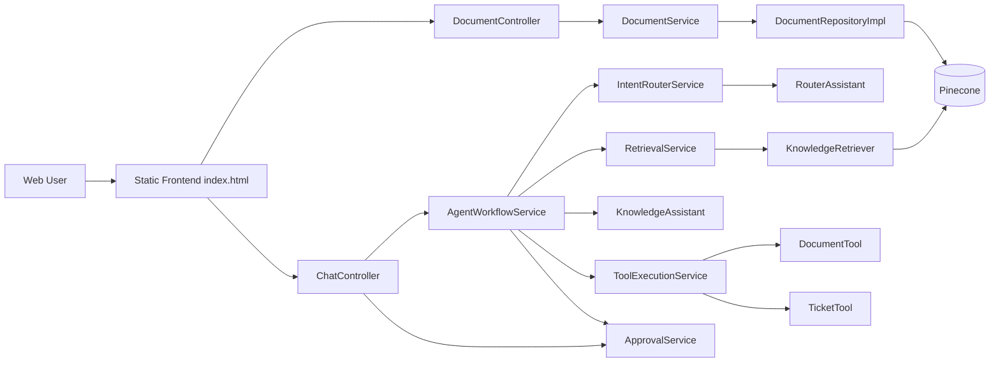

# Enterprise Knowledge Assistant

## 项目背景
企业内部知识通常分散在制度文档、SOP、FAQ、技术规范中。实际使用中常见问题包括：
- 信息分散，检索路径长
- 文档版本不一致，答复口径不统一
- 复杂请求既包含问答也包含动作执行（如查文档、提工单）

本项目目标是构建一个可落地的企业知识助手：
- 支持文档上传、知识入库与检索增强问答（RAG）
- 支持基于 Agent 的意图路由与工具执行
- 支持敏感动作审批确认（approve）

## 核心能力
1. 文档上传入库
- 接口：`POST /api/documents/upload`
- 支持文档类型：`POLICY` / `TECH_TYPE` / `SOP` / `FAQ`

2. Agent 问答（主入口）
- 接口：`POST /api/chat/agent/ask`
- 前端已统一为 Agent 问答入口（不再使用普通对话按钮）

3. 审批执行
- 接口：`POST /api/chat/agent/approve?token=...`
- ACTION_REQUEST 需要审批时，前端弹窗确认后调用

4. 路由输出文档类型并驱动工具执行
- 路由模型输出：`intentType` / `reason` / `documentType`
- `AgentWorkflowService#handleActionRequest` 直接消费 `documentType` 执行文档工具

5. 兼容接口（已废弃）
- `POST /api/chat/dialogue` 保留兼容，后端已标记 `@Deprecated`

## 架构图


## 数据流
1. 文档上传数据流
- 前端上传 `file + docType`
- `DocumentController -> DocumentService`
- `DocumentService` 处理文本并写入文档元数据
- `DocumentRepositoryImpl` 切分 + embedding + 写入向量库

2. Agent 问答数据流
- 前端提交 `userId + message` 到 `/api/chat/agent/ask`
- `IntentRouterService` 调用 `RouterAssistant` 生成路由结果（含 `documentType`）
- `AgentWorkflowService` 分支执行：
  - `KNOWLEDGE_QA` / `PROCESS_QA`：检索上下文后调用 `KnowledgeAssistant`
  - `ACTION_REQUEST`：调用工具（文档查询 / 工单审批流程）

3. 审批数据流
- ACTION_REQUEST 返回 `approvalRequired=true` 与 `approvalToken`
- 前端确认后调用 `/api/chat/agent/approve?token=...`
- `ApprovalService` 校验并执行对应工具

## 运行方式
### 1) 环境要求
- JDK 17+
- Maven 3.9+
- MySQL 8+

### 2) 必要配置
- `src/main/resources/application.properties`
- `src/main/resources/db.setting`
- 环境变量：`MINIMAX_API_KEY`、`PINECONE_API_KEY`

### 3) 启动
```bash
mvn spring-boot:run
```

### 4) 访问
- `http://localhost:8080/`

### 5) 编码注意事项
- Java 源码请统一使用 UTF-8（无 BOM），避免 `illegal character: '\ufeff'` 编译错误。
